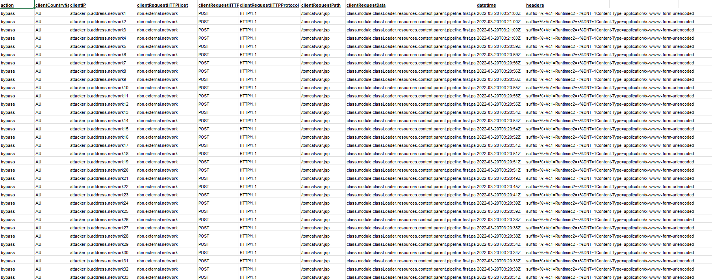
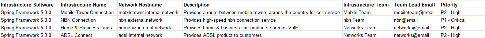

# Cybersecurity Workshop by Telstra

```
Aim: 
- Practice what day to day job of an analyst on Mastercard’s Security Awareness Team
- Helped identify and report security threats such as phishing 
- Analyzed and identified which areas of the business needed more robust security training and implemented training courses and procedures for those teams

Description:
Task 1: Examine an obvious fake email and make it more believable 
Task 2: Design a short presentation to educate staffs on Phishing attempts
```

## Task 1-Responding to a malware attack

#### Background

You are an information security analyst in the Security Operations Centre.A common task and responsibility of information security
analysts in the SOC is to respond to triage incoming threats and respond appropriately, by notifying the correct team depending on
the severity of the threat. It’s important to be able to communicate the severity of the incident to the right person so that
the organisation can come together in times of attack.

The firewall logs & list of infrastructure has been provided, which shows critical services that run the Spring Framework and need
to be online / uninterrupted. A list of teams has also been provided, which depending on the severity of the threat, must be contacted.
It’s important to note that the service is down and functionality is impaired due to the malware attack.

#### Task objective

Your task is to triage the current malware threat and figure out which infrastructure is affected.
First, find out which key infrastructure is currently under attack. Note the priority of the affected
infrastructure to the company - this will determine who is the respective team to notify.

After, draft an email to the respective team alerting them of the current attack so that they can begin an incident response.
Make sure to include the timestamp of when the incident occurred. Make it concise and contextual.

The purpose of this email is to ensure the respective team is aware of the ongoing incident and to be prepared for mitigation advice.

#### Resources for Task






```
From: Telstra Security Operations
To: <Mobile Team, nbn Team, Networks Team> (<mobileteam@email, nbn@email, networks@email>)
Subject: <Malware Breach through Spring Framework 5.3>
—
Body: 
To Mobile, nbn and Networks Team,

At 14:16 Mar 20th, the security team has noticed an abnormal Firewall activity.
After examining, we received a large amount of Firewall bypass from an attacker in Australia. 
The attacker is trying to post and execute a malicious file(tomcatwar.jsp) through the nbn.external.network.
Please do a scan and if the aforementioned .jsp file if found, remove it asap. 
The breach is caused by a vulnerability in the Spring Cloud Function
(RCE Vulnerability code: CVE-2022-22965 also known as Spring4Shell). 

Below versions and Framework are compromised:
Spring Cloud Function version 3.1.6 and 3.2.2
Spring Framework versions 5.3.0 to 5.3.17 and 5.2.0 to 5.2.19

Details
The bypass of the patch can occur because Java Development Kit (JDK) versions 9 and later provide
two sandbox restriction methods, providing a path to exploit CVE-2010-1622
(JDK versions before 9 only provide one sandbox restriction method).

Solution
Please follow the below link for stable updates and patches for Spring Framework:
5.3.18+
5.2.20+

Latest Spring Cloud Function update
https://spring.io/blog/2022/03/29/cve-report-published-for-spring-cloud-function

Latest Spring Framework RCE
https://spring.io/blog/2022/03/31/spring-framework-rce-early-announcement


For any questions or issues, don’t hesitate to reach out to us.

Kind regards,
Telstra Security Operations

```
Main Point of this email
1. Give a brief background on the event, including time, who, and what
2. Clearly state what has been affected and their versions
3. Reason why on why the breach happened and provide solution
4. Follow up with additional details if needed

---

## Task 2


---
### Reference and Additional Info
[sprin4shell](https://www.cisa.gov/news-events/alerts/2022/04/01/spring-releases-security-updates-addressing-spring4shell-and-spring)
[CVE-2022-22965: Spring Framework RCE via Data Binding on JDK 9+](https://spring.io/security/cve-2022-22965)
