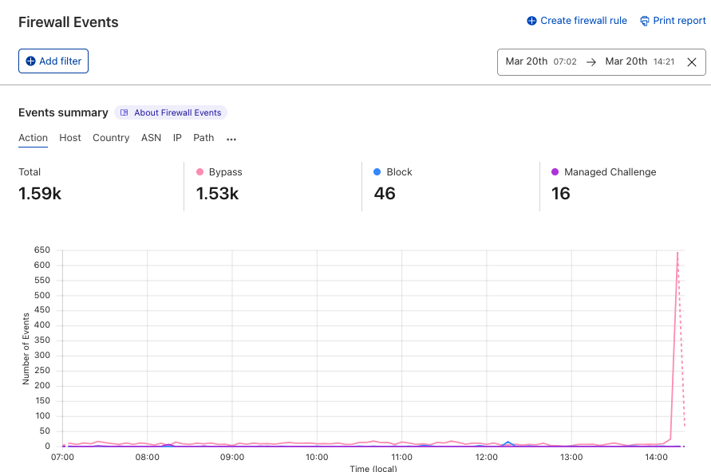
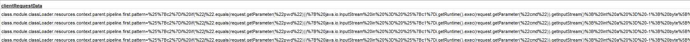

# Cybersecurity Workshop by Telstra

```
Aim: 
- Practice what day to day job of an analyst on Mastercard’s Security Awareness Team
- Helped identify and report security threats such as phishing 
- Analyzed and identified which areas of the business needed more robust security training and implemented training courses and procedures for those teams

Description:
Task 1: Examine an obvious fake email and make it more believable 
Task 2: Design a short presentation to educate staffs on Phishing attempts
```

## Task 1-Responding to a malware attack

#### Background

You are an information security analyst in the Security Operations Centre.A common task and responsibility of information security
analysts in the SOC is to respond to triage incoming threats and respond appropriately, by notifying the correct team depending on
the severity of the threat. It’s important to be able to communicate the severity of the incident to the right person so that
the organisation can come together in times of attack.

The firewall logs & list of infrastructure has been provided, which shows critical services that run the Spring Framework and need
to be online / uninterrupted. A list of teams has also been provided, which depending on the severity of the threat, must be contacted.
It’s important to note that the service is down and functionality is impaired due to the malware attack.

#### Task objective

Your task is to triage the current malware threat and figure out which infrastructure is affected.
First, find out which key infrastructure is currently under attack. Note the priority of the affected
infrastructure to the company - this will determine who is the respective team to notify.

After, draft an email to the respective team alerting them of the current attack so that they can begin an incident response.
Make sure to include the timestamp of when the incident occurred. Make it concise and contextual.

The purpose of this email is to ensure the respective team is aware of the ongoing incident and to be prepared for mitigation advice.

#### Resources for Task






Destricption of what happened

-Event happened at 2 16pm
-Origin suggest attacker is from AU-Australia
-Status: Bypass
-Source IP: Attackers IP
-Destination: nbn service
-File/Path: file being post
-Client Request Data: actualy execution `Runtime.getRuntime().exec()`
-Affected Teams: Only nbn is critical, however, other teams are also exposed and should be informed.

Email suggestion
```
From: Telstra Security Operations
To: <Mobile Team, nbn Team, Networks Team> (<mobileteam@email, nbn@email, networks@email>)
Subject: <Malware Breach through Spring Framework 5.3>
—
Body: 
To Mobile, nbn and Networks Team,

At 14:16 Mar 20th, the security team has noticed an abnormal Firewall activity.
After examining, we received a large amount of Firewall bypass from an attacker in Australia. 
The attacker is trying to post and execute a malicious file(tomcatwar.jsp) to nbn.external.network.
This has led to downtime across our nbn network leading to impaired service functionality

Other teams with the below mentioned services are also exposed to the vulnerability.
Please do a scan and if the aforementioned .jsp file if found, remove it asap.
Telstra Security Operations is monitoring the incident and will revert with an update.
Please have site reliability engineers on standby for mitigation

Below versions and Framework are compromised:
Spring Cloud Function version 3.1.6 and 3.2.2
Spring Framework versions 5.3.0 to 5.3.17 and 5.2.0 to 5.2.19

Solutions an Updates
Please follow the below link for stable updates and patches for Spring Framework:
5.3.18+
5.2.20+

Details of the Event
Spring Cloud Function 
https://spring.io/blog/2022/03/29/cve-report-published-for-spring-cloud-function
Spring Framework RCE
https://spring.io/blog/2022/03/31/spring-framework-rce-early-announcement


For any questions or issues, don’t hesitate to reach out to us.

Kind regards,
Telstra Security Operations

```
Main Point of this email
1. Give a brief background on the event, including time, who, and what
2. Clearly state what has been affected and their versions
3. Reason on why the breach occured and provide solution, and ask for engineers to be on standby mode for mitigation
4. Follow up with additional details if needed

---

## Task 2-Block the Attack with a firewall Rule

#### Background

Now that you have notified the infrastructure owner of the current attack, analyse the firewall logs to find the pattern in the attacker’s network requests. You won’t be able to simply block IP addresses, because of the distributed nature of the attack, but maybe there is another characteristic of the request that is easy to block.

An important responsibility of an information security analyst is the ability to work across disciplines with multiple teams, both technical and non-technical.

#### Task Objective
Analyse the firewall logs in the resources section.

Next, identify what characteristics of the Spring4Shell vulnerability have been used.

Finally, draft an email to the networks team with your findings. Make sure to be concise, so that they can develop the firewall rule to mitigate the attack. You can assume the recipient is technical and has dealt with these types of requests before.

```
From: Telstra Security Operations
To: <nbn Team> (<nbn@email>)
Subject: [IMPORTANT] Create Firewall Rule to mitigate malware attack
—
Body: 
To Team nbn, 

We would like to request the creation of a firewall rule and provide you more information about the ongoing attack.

The attack is a Remote Code Execution (RCE). As firewall log suggested, the actor is trying to submit data with the POST method. The payload 'Runtime.getRuntime().exec()' is to executed the file tomcatwar.jsp

The traffic can be blocked by following ways:

1.  Block incoming traffic on client request path '/tomcatwar.jsp'
2.  Block specific parameters such as cmd, exec, which all related to file execution
3.  Block command execution attempts: Block patterns that are commonly used in code injection or execution attempts such as Runtime.getRuntime().exec()'
4.  Block all traffic going through port 80(HTTP)

For any questions or issues, don’t hesitate to reach out to us.

Kind regards,
Telstra Security Operations

```

## Task 3-Mitigate the malware attack

#### Background

Work with the networks team to implement a firewall rule using the Python scripting language. Python is a common scripting language used across both offensive and defensive information security tasks.

In this task, we will simulate the firewall’s scripting language by using an HTTP Server. You can assume this HTTP Server has no computational requirements and has the sole purpose of filtering incoming traffic.

In the starter codebase, you will find a test script that you can use to simulate the malicious requests to the server.

#### Task Objective

Use Python to develop a firewall rule to mitigate the attack. Develop this rule in `firewall_server.py` and only upload this file back here.

You may use `test_requests.py` to test your code whilst the firewall HTTP server is running.


---
### Reference and Additional Info
[sprin4shell](https://www.cisa.gov/news-events/alerts/2022/04/01/spring-releases-security-updates-addressing-spring4shell-and-spring)
[CVE-2022-22965: Spring Framework RCE via Data Binding on JDK 9+](https://spring.io/security/cve-2022-22965)
